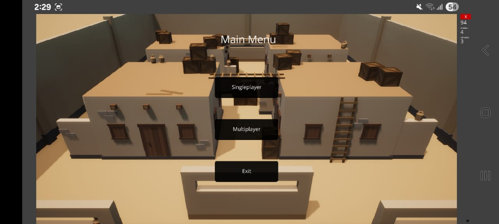
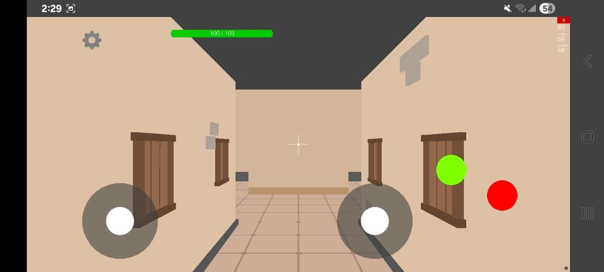
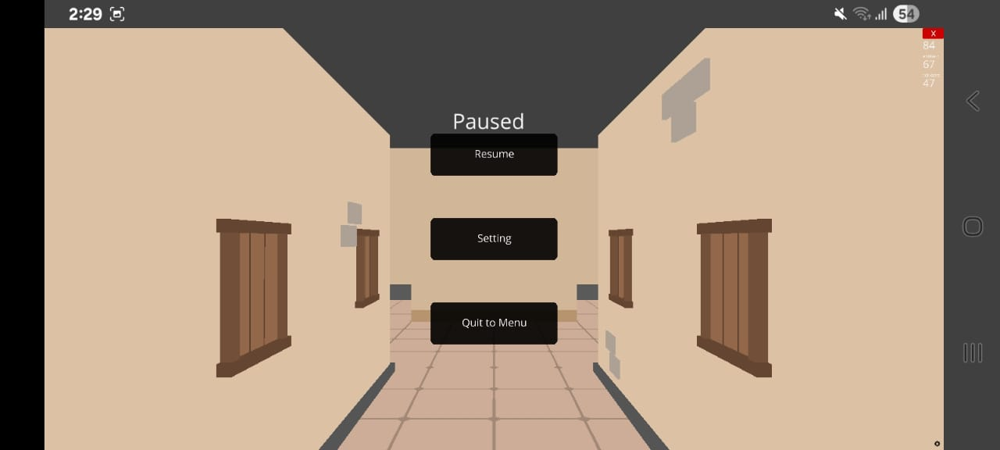
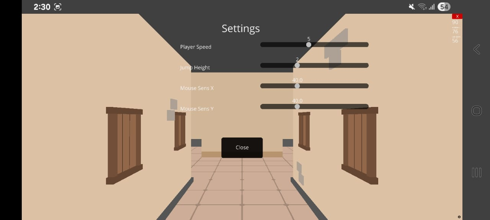
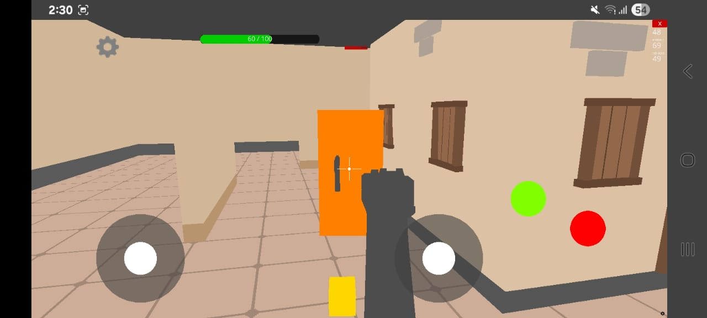
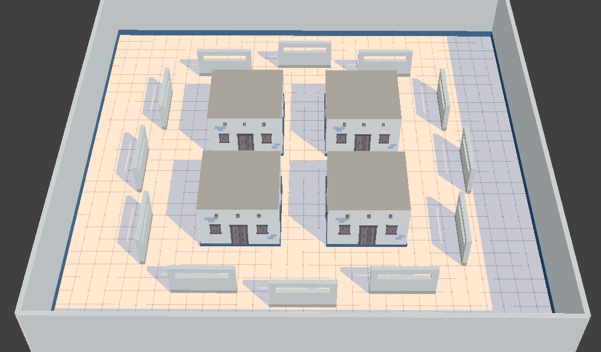

[](https://github.com/ShivamKR12/Echoes/actions/workflows/build-apk.yml)
[](https://github.com/ShivamKR12/Echoes/releases/latest/download/universal.apk)
[](https://github.com/ShivamKR12/Echoes/releases/latest)
[](LICENSE)
[](https://discord.com/channels/593486730187899041/1125361114243403786/threads/1404740663722901575)
[](https://github.com/ShivamKR12/Echoes/stargazers)

# Echoes: Ursina for Android

Welcome to **Echoes**, a proof-of-concept game demonstrating how to use Panda3D/Ursina to build games for Android devices.

## Introduction

Have you ever wanted to run your Ursina game on Android? With this guide, you’ll learn how to set up your environment, port your game, and customize your project for mobile devices.

Currently, only Android is supported. iOS support is not planned due to Panda3D limitations.

## Getting Started

### 1. Clone the Repository

First, make sure you have [Git](https://git-scm.com/downloads) installed. Open your terminal and run:

```bash
git clone https://github.com/ShivamKR12/Echoes
```

### 2. Install Python Dependencies

Install [Python 3.8](https://www.python.org/downloads/release/python-380/). This is required for Panda3D on Android.

Ensure Python 3.8 is in your PATH and is the default Python installation. If `python --version` does not return `Python 3.8.X`, use `python3.8` instead of `python` in all commands.

Install the required packages:

```bash
python -m pip install protobuf==3.20.0
```

Install Panda3D for your operating system:

**Windows:**
```powershell
python -m pip install https://buildbot.panda3d.org/downloads/68f0931f43284345893a90d5bba9ba5df8aa53bb/panda3d-1.11.0.dev2480-cp38-cp38-win_amd64.whl
```

**macOS:**
```zsh
python -m pip install https://buildbot.panda3d.org/downloads/68f0931f43284345893a90d5bba9ba5df8aa53bb/panda3d-1.11.0.dev2480-cp38-cp38-macosx_10_9_x86_64.whl
```

**Linux:**
```bash
python -m pip install https://buildbot.panda3d.org/downloads/68f0931f43284345893a90d5bba9ba5df8aa53bb/panda3d-1.11.0.dev2480-cp38-cp38-manylinux2010_x86_64.whl
```

If you encounter issues with the wheel files, please open an issue on the repository.

### 3. Set Up Your Game

Create a `setup.py` file using the provided template. Update the following fields:

- `name`: Set to your game name (e.g., `'Echoes'`)
- `version`: Set your game version
- `application_id`: Use a unique identifier (e.g., `'com.yourcompany.echoes'`)
- `android_version_code`: Increment this for each Play Store release
- `gui_apps`: Map your app name to your main Python file (e.g., `'echoes': 'game/__main__.py'`)
- `icons`: Set your app icon (e.g., `'icons': {'*': 'mylogo.png'}`)

**Important:** Do not remove the `ursina_assets` folder or its entry in `include_patterns`.

#### Understanding Android Build Configuration

- **Application ID:** This is a unique identifier for your app on the Google Play Store. It should be based on your domain name in reverse (e.g., `com.yourcompany.yourapp`). **Caution:** Once your app is uploaded to the Play Store, you cannot change the application ID. Choose it carefully.

- **Android Version Code:** This is an integer that starts at 1 and must be incremented for each new version uploaded to the Play Store. It is used internally by the Play Store for version management, separate from the user-visible version string.

- **Renderer Options:** The setup uses `pandagles2` as the primary renderer (with shaders) and `pandagles` as a fallback (fixed-function pipeline). These are required for Android as the regular `pandagl` renderer is not available. Use `pandagles2` if your game uses shaders; otherwise, use `pandagles`.

For more advanced build options, refer to the [Panda3D Build Options Documentation](https://www.panda3d.org/manual/android/building_for_android.php#list-of-build-options).

#### Alternative Signing Method for Play Store

Instead of signing during bundletool conversion, you can sign the .aab bundle directly for Play Store upload. Generate a certificate using OpenSSL:

```bash
openssl genpkey -algorithm RSA -aes256 -out private.pem
openssl req -new -x509 -sha256 -days 365 -key private.pem > cert.pem
```

Never share the private key! Then, modify setup.py to include signing:

```python
'bdist_apps': {
    'signing_certificate': 'cert.pem',
    'signing_private_key': 'private.pem',
},
```

Alternatively, use keytool to generate a keystore and sign manually with jarsigner.

**Disclaimer:** Choose between signing during build (as above) or during bundletool conversion (in step 5). For Play Store uploads, signing the .aab is recommended.

#### Updating Android Version Code for Play Store Releases

For each new version uploaded to the Play Store, increment the `android_version_code` in setup.py by 1. This is required for the Play Store to accept the update.

#### Additional Build Options

Note that the `android_abis` option (e.g., `'android_abis': ['arm64-v8a']`) can be used in `setup.py` to specify which Android CPU architectures to build for. This option is not listed in the official build options but is supported.

#### BundleTool Build Command Options

When using the `bundletool build-apks` command, you can specify various flags to customize the build:

| Flag               | Description                                                                                                         |
|--------------------|---------------------------------------------------------------------------------------------------------------------|
| --bundle=path      | (Required) Path to the app bundle (.aab) you built.                                                                 |
| --output=path      | (Required) Name of the output .apks file containing all APK artifacts.                                               |
| --overwrite        | Overwrites existing output file if it exists.                                                                        |
| --aapt2=path       | Specifies a custom path to AAPT2. By default, bundletool includes its own version.                                   |
| --ks=path          | (Optional) Path to the keystore used to sign the APKs. If omitted, bundletool signs with a debug key.                |
| --ks-pass=pass:password or --ks-pass=file:/path/to/file | Specifies the keystore password, either inline or from a file.                                      |
| --ks-key-alias=alias | Alias of the signing key to use.                                                                                   |
| --key-pass=pass:password or --key-pass=file:/path/to/file | Password for the signing key. Can be omitted if same as keystore password.                          |
| --connected-device | Builds APKs targeting the configuration of a connected device.                                                       |
| --device-id=serial-number | Specifies the serial ID of the device to target if multiple devices are connected.                              |
| --device-spec=spec_json | Path to a JSON file specifying the device configuration to target.                                                |
| --mode=universal   | Builds a single universal APK compatible with all device configurations. Larger but easier for testing.              |
| --local-testing    | Enables local testing mode for quick iterative testing without uploading to Play Store.                              |

Use these flags to customize your APK builds when running the `bundletool build-apks` command in step 5.

Place your Ursina game inside the `game` folder. At the top of your main script, add:

```python
from setup_ursina_android import setup_ursina_android
setup_ursina_android()
```

Edit `game/setup_ursina_android.py` and set `app_id` to match your `application_id` in `setup.py`.

If your game requires additional Python packages, add them to `requirements.txt`. Only add new dependencies; do not remove existing ones.

#### Customizing Your Project

- **Assets:** Place your assets in `game/assets`. Add `'game/assets/**'` to `include_patterns` in `setup.py`. **Important:** Ensure all assets are included in `include_patterns`, especially `ursina_assets/**` and `game/assets/**`, as missing assets can cause the app to crash.

- **Asset List:** List your assets in `game/setup_ursina_android.py`:
    ```python
    game_assets = ['your_first_file.png', 'your_second_file.png']
    game_assets_src_dir = "game/assets"
    ```
- **Using Assets:** Load assets in your game like:
    ```python
    from ursina import Entity
    Entity(texture="your_first_file.png")
    ```
- **Dependencies:** Add PyPI dependencies to `requirements.txt`. Ensure they support Python 3.8 and are platform-independent (`py3-none-any`).

### 4. Install Android Dependencies

- Enable developer options and USB debugging on your Android device.
- Install [ADB](https://www.xda-developers.com/install-adb-windows-macos-linux/).
- Install [Java](https://www.oracle.com/java/technologies/downloads/).
- Download [BundleTool](https://github.com/google/bundletool/releases).

### 5. Build and Deploy Your Game

**Build the Android App Bundle (AAB):**

Navigate to the `src` directory and run:

```bash
python setup.py bdist_apps
```

**Convert AAB to APKS:**

you would need a key to sign the `.aab` when converting it to `.apks` or otherwise, Android wouldn't let you install the `.apk` . use the below command to create a key :

**Windows:**
```powershell
keytool -genkeypair -alias <alias-name> -keyalg RSA -keysize 2048 -validity 10000 -keystore <keystore-name.keystore> -storepass "your_keystore_password" -keypass "your_key_password" -dname "CN=YourName, OU=YourUnit, O=YourOrg, L=YourCity, ST=YourState, C=YourCountry"
```

**macOS:**
```zsh
keytool -genkeypair -alias <alias-name> -keyalg RSA -keysize 2048 -validity 10000 -keystore <keystore-name.keystore> -storepass "your_keystore_password" -keypass "your_key_password" -dname "CN=YourName, OU=YourUnit, O=YourOrg, L=YourCity, ST=YourState, C=YourCountry"
```

**Linux:**
```bash
keytool -genkeypair -alias <alias-name> -keyalg RSA -keysize 2048 -validity 10000 -keystore <keystore-name.keystore> -storepass "your_keystore_password" -keypass "your_key_password" -dname "CN=YourName, OU=YourUnit, O=YourOrg, L=YourCity, ST=YourState, C=YourCountry"
```

Use BundleTool to convert your `.aab` to `.apks`:

**Windows:**
```powershell
java -jar "Path/To/BundleTool/bundletool.jar" build-apks --bundle "./dist/app-release.aab" --output "./dist/app.apks"  --ks "Path/To/Your-keystore.keystore" --ks-pass pass:your_keystore_password --ks-key-alias <alias-name> --key-pass pass:your_keystore_password --mode universal --verbose
```

**macOS:**
```zsh
java -jar "Path/To/BundleTool/bundletool.jar" build-apks --bundle "./dist/app-release.aab" --output "./dist/app.apks"  --ks "Path/To/Your-keystore.keystore" --ks-pass pass:your_keystore_password --ks-key-alias <alias-name> --key-pass pass:your_keystore_password --mode universal --verbose
```

**Linux:**
```bash
java -jar "Path/To/BundleTool/bundletool.jar" build-apks --bundle "./dist/app-release.aab" --output "./dist/app.apks"  --ks "Path/To/Your-keystore.keystore" --ks-pass pass:your_keystore_password --ks-key-alias <alias-name> --key-pass pass:your_keystore_password --mode universal --verbose
```

If you get a file exists error, delete `dist/app.apks` and try again.

then extract the `.apk` output of the `.apks` using any archieve extractors. or you can do :

**Windows:**
```powershell
# Make output folder
New-Item -ItemType Directory -Path "/path/to/extract/folder" -Force

# Rename .apks to .zip
Rename-Item -Path "path/to/app.apks" -NewName "app.zip"

# Extract zip
Expand-Archive -LiteralPath "/path/to/app.zip" -DestinationPath "/path/to/extract/folder" -Force
```

**macOS:**
```zsh
# Make output folder
mkdir -p /path/to/extract/folder

# Unzip directly without renaming
unzip /path/to/app.apks -d /path/to/extract/folder
```

**Linux:**
```bash
# Make output folder
mkdir -p /path/to/extract/folder

# Unzip directly without renaming
unzip /path/to/app.apks -d /path/to/extract/folder
```

**Install the APK on Your Device:**

Connect your device and verify with:

```bash
adb devices
```

Install your app:

```bash
adb install "Path/to/your/app.apk"
```

For more information on BundleTool, refer to the [BundleTool Documentation](https://developer.android.com/tools/bundletool).

## Troubleshooting

### Common Build Errors

- **Missing .aab file:** Ensure the build command `python setup.py bdist_apps` completes successfully. Check for errors in the console output.
- **Signing errors:** If signing fails, verify your keystore path, passwords, and alias. Use `keytool -list -v -keystore <keystore-name.keystore>` to check the keystore.
- **Device connection issues:** Run `adb devices` to confirm your device is connected. Enable USB debugging in developer options.
- **BundleTool errors:** Ensure Java is installed and BundleTool is the latest version. Use `--verbose` flag for more details.

### Tips

- Always test on a physical device rather than emulator for accurate performance.
- If the app crashes on launch, check logs with `adb logcat` for Python errors.
- Ensure all assets are included in `include_patterns` in setup.py, especially `ursina_assets/**` and `game/assets/**`.

### 6. Debugging and Logs

View your app logs with:

```bash
adb logcat -v brief -v color Panda3D:V Python:V *:S
```

Clear logs:

```bash
adb logcat -c
```

You can use `print()` in your Python code to output to logcat.

### 7. Testing Locally

To test your game without building for Android each time, install Ursina 7.0.0 for Python 3.8:

```bash
python3.8 -m pip install src/wheels/ursina-7.0.0-py3-none-any.whl
```

Run your game:

```bash
python3.8 src/game/__main__.py
```

### 8. Tips for Mobile Porting

- Desktop input methods (mouse, keyboard) do not work on Android. Replace them with touch controls or virtual joysticks.
- Optimize for mobile performance and screen sizes.
- Adapt your UI and controls for touch interaction.

## Contributing & Support

If you need help or want to contribute, open an issue or pull request on [ShivamKR12/Echoes](https://github.com/ShivamKR12/Echoes).

Special thanks to the Ursina and Panda3D communities for their support and inspiration.

---

Thank you for checking out Echoes and exploring Ursina on Android!

## Screenshots

Here are some screenshots showcasing what the game has to offer:







